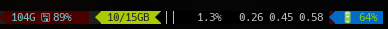

=============================================
            tmux-mem-cpu-load
=============================================
---------------------------------------------
CPU, RAM, and load monitor for use with tmux_
---------------------------------------------

.. image:: https://travis-ci.org/thewtex/tmux-mem-cpu-load.svg
  :target: https://travis-ci.org/thewtex/tmux-mem-cpu-load

.. image:: https://circleci.com/gh/thewtex/tmux-mem-cpu-load.svg?style=svg
  :target: https://circleci.com/gh/thewtex/tmux-mem-cpu-load
  
.. image:: https://github.com/thewtex/tmux-mem-cpu-load/actions/workflows/main.yml/badge.svg
   :target: https://github.com/thewtex/tmux-mem-cpu-load/actions/workflows/main.yml

Description
===========

A simple, lightweight program provided for system monitoring in the *status*
line of **tmux**.

The memory monitor displays the used and available memory.

The CPU usage monitor outputs a percent CPU usage over all processors. It also
displays a textual bar graph of the current percent usage.

The system load average is also displayed.

Example output::

  2885/7987MB [|||||     ]  51.2% 2.11 2.35 2.44

   ^    ^          ^         ^     ^    ^    ^
   |    |          |         |     |    |    |
   1    2          3         4     5    6    7

1. Currently used memory.
2. Available memory.
3. CPU usage bar graph.
4. CPU usage percentage.
5. Load average for the past minute.
6. Load average for the past 5 minutes.
7. Load average for the past 15 minutes.

For `terminals with 256 color support`_, graded colors can be displayed by
passing the **--colors** flag.

Installation
============

Dependencies
------------

Currently, Linux, Mac OSX, FreeBSD, OpenBSD, and NetBSD are supported.

Building
~~~~~~~~

* >= CMake_ -3.5
* C++ compiler with C++11 support (e.g. gcc/g++ >= 4.6)

Download
--------

There are links to the source code at the `project homepage`_.

Build
-----

::

  cd <source dir>
  cmake .
  make

Install
-------

::

  su -
  make install
  logout

Build and Install Using tpm_
-----------------------------

Include the plugin in your ``.tmux.conf``, the same file you'll set the
configuration in, below.

::

  set -g @plugin 'thewtex/tmux-mem-cpu-load'

Install with Package Managers
-----------------------------

* Gentoo: ``emerge tmux-mem-cpu-load``
* Homebrew: ``brew install tmux-mem-cpu-load``

Build and Install Using Antigen_
--------------------------------

Include the bundle in your ``.zshrc``

::

  antigen bundle thewtex/tmux-mem-cpu-load

Configuring tmux_
=================

Edit ``$HOME/.tmux.conf`` to display the program's output in *status-left* or
*status-right*.  For example::

  set -g status-interval 2
  set -g status-left "#S #[fg=green,bg=black]#(tmux-mem-cpu-load --colors --interval 2)#[default]"
  set -g status-left-length 60

If you installed using tpm, you must specify the full path to the
``tmux-mem-cpu-load`` script, like below::

  set -g status-right '#[fg=green]#($TMUX_PLUGIN_MANAGER_PATH/tmux-mem-cpu-load/tmux-mem-cpu-load --colors --powerline-right --interval 2)#[default]'

Note that the *interval* argument to `tmux-mem-cpu-load` should be the same number
of seconds that *status-interval* is set at.

Another optional argument is the number of bars in the bar graph, which
defaults to 10.  This can, for instance, be set to the number of cores in a
multi-core system.

The *colors* option will add graded colors for each of the measures.

The full usage::

  Usage: tmux-mem-cpu-load [OPTIONS]

  Available options:
  -h, --help
           Prints this help message
  -c, --colors
          Use tmux colors in output
  -p, --powerline-left
	  Use powerline left symbols throughout the output, enables --colors
  -q, --powerline-right
	  Use powerline right symbols throughout the output, enables --colors
  -v, --vertical-graph
	  Use vertical bar chart for CPU graph
  -l <value>, --segments-left <value>
	  Enable blending bg/fg color (depending on -p or -q use) with segment to left
	  Provide color to be used depending on -p or -q option for seamless segment blending
	  Color is an integer value which uses the standard tmux color palette values
  -r <value>, --segments-right <value>
	  Enable blending bg/fg color (depending on -p or -q use) with segment to right
	  Provide color to be used depending on -p or -q option for seamless segment blending
	  Color is an integer value which uses the standard tmux color palette values
  -i <value>, --interval <value>
          Set tmux status refresh interval in seconds. Default: 1 second
  -g <value>, --graph-lines <value>
          Set how many lines should be drawn in a graph. Default: 10
  -m <value>, --mem-mode <value>
        Set memory display mode. 0: Default, 1: Free memory, 2: Usage percent.
  -t <value>, --cpu-mode <value>
        Set cpu % display mode. 0: Default max 100%, 1: Max 100% * number of threads.
  -a <value>, --averages-count <value>
        Set how many load-averages should be drawn. Default: 3

Blending Dynamic Colors Tmux Powerline Segments
===============================================

The -l and -r options when used in conjunction with a recent version of Tmux Powerline
that has the ability to selectively disable spacing and separators between segments allow
for seamless blending of tmux-mem-cpu-load output with other adjacent segments.  The end
result is dynamic changing of appropriate foreground and background colors as the start
and end of the tmux-mem-cpu-load output string that is aggregated with other Tmux
Powerline output to produce a more polished status line in Tmux.

Segment Adjaceny before this feature:

Segment Adjaceny after this feature:

Note that the values for the -l and -r options  will be the standard Tmux integer color
values.  They set the appropriate background and foreground colors used for the separator
character when used with the poweline-left or powerline-right options so it is easy to
match coloring to adjacent segments.  An example from the segment script that calls
tmux-mem-cpu-load is as follows::

  tmux-mem-cpu-load -q -v -l 52 -r 33

This combines with theme options available to tmux-powerline, such as the following::

  "disk_usage_cust 52 123 ${TMUX_POWERLINE_SEPARATOR_LEFT_BOLD} 52 123 right_disable" \
  "tmux_mem_cpu_load_cust 52 234 ${TMUX_POWERLINE_SEPARATOR_LEFT_BOLD} 52 234 both_disable separator_disable" \
  "batt_cust 33 154 ${TMUX_POWERLINE_SEPARATOR_LEFT_BOLD} 16 33 N separator_disable" \  

Authors
=======

Matt McCormick (thewtex) <matt@mmmccormick.com>

Contributions from:

* cousine <iam@cousine.me>
* Jasper Lievisse Adriaanse <jasper@humppa.nl>
* Justin Crawford <justinc@pci-online.net>
* krieiter <krieiter@gmail.com>
* Mark Palmeri <mlp6@duke.edu>
* `Pawel 'l0ner' Soltys`_ <pwslts@gmail.com>
* Travil Heller <trav.heller@gmail.com>
* Tony Narlock <tony@git-pull.com>
* Compilenix <Compilenix@compilenix.org>
* jodavies <jodavies1010@gmail.com>
* `@nhdaly`_ (Nathan Daly) <nhdaly@gmail.com>
* bensuperpc <bensuperpc@gmail.com>

.. _tmux: http://tmux.sourceforge.net/
.. _CMake: http://www.cmake.org
.. _`project homepage`: http://github.com/thewtex/tmux-mem-cpu-load
.. _`tpm`: http://github.com/tmux-plugins/tpm
.. _`Antigen`: https://github.com/zsh-users/antigen
.. _`terminals with 256 color support`: http://misc.flogisoft.com/bash/tip_colors_and_formatting#terminals_compatibility
.. _`Pawel 'l0ner' Soltys` : http://l0ner.github.io/
.. _`@nhdaly` : http://github.com/nhdaly
